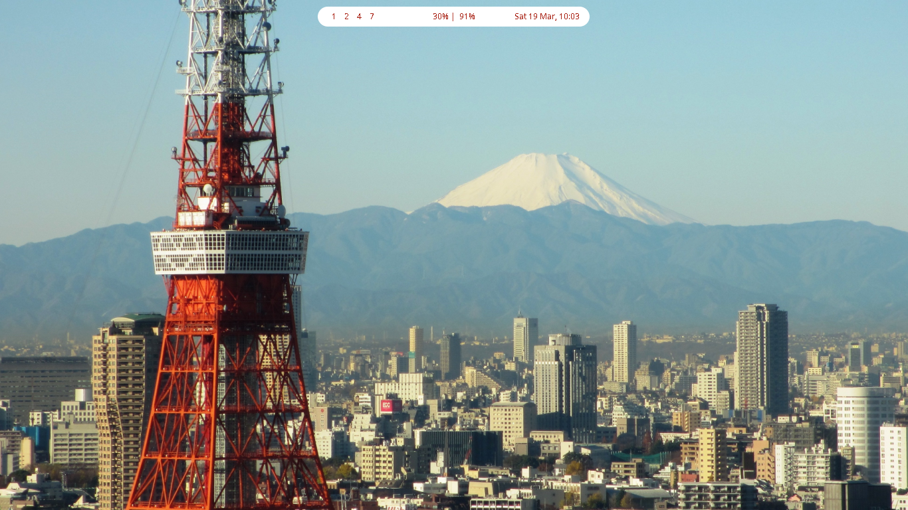
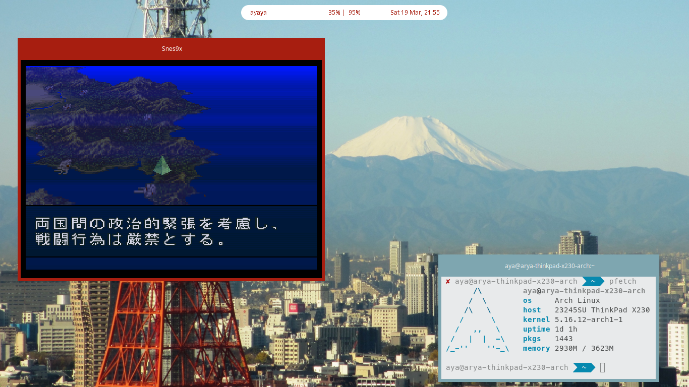
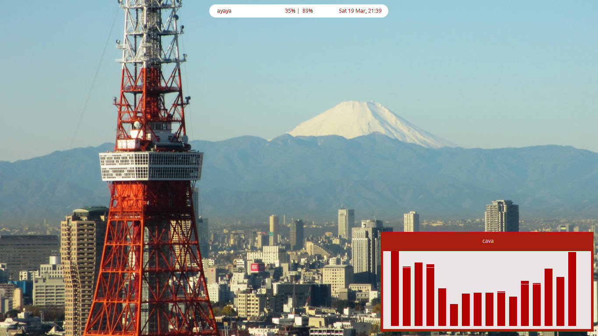

# berry-rice
My personalisation Berry WM for daily use

Still work in progress, minimalist and elegant fuji san scheme  

## Application used

For application i use

| Name                                                | Function                                     |
|-----------------------------------------------------|----------------------------------------------|
| [Dunst](https://github.com/dunst-project/dunst)     | For notification purpose                     |
| [Zathura](https://github.com/pwmt/zathura)          | For read e-books etc                         |
| [NekoVim](https://github.com/RyaWcksn/Neko-Vim)     | My personal neovim config for code and write |
| [Firefox](https://github.com/mozilla)               | Web browser                                  |
| [Alacritty](https://github.com/alacritty/alacritty) | Termial emulator                             |
| [Cava](https://github.com/karlstav/cava)            | Audio visualizer                             |
| [Polybar](https://github.com/polybar/polybar)       | Bar                                          |
